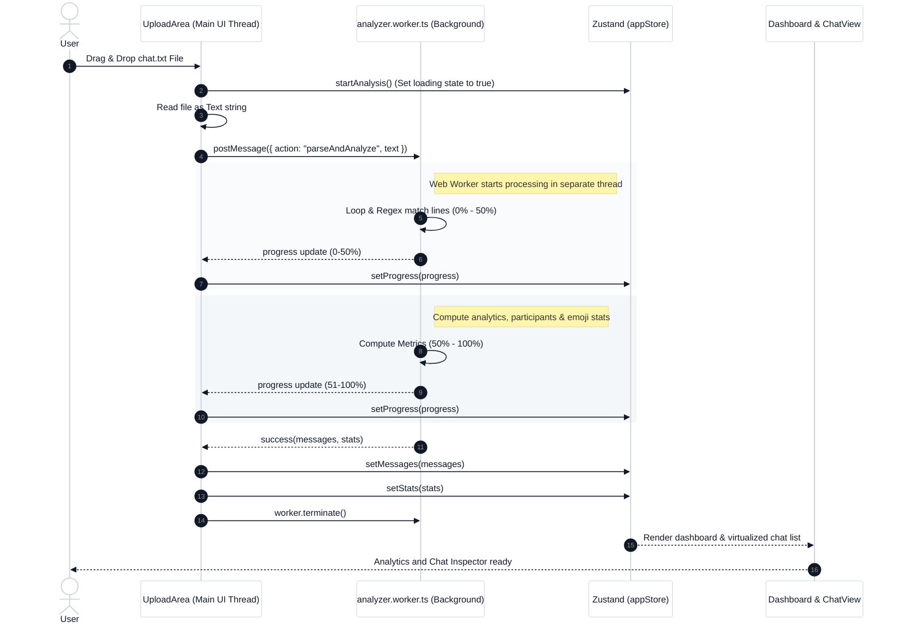

# Wali 📊💬
[](https://nextjs.org/) [](https://bun.sh/) [](https://tailwindcss.com/) [](https://www.typescriptlang.org/)

**Wali** (WhatsApp Local Inspector) is a premium, high-performance, and **100% private** local WhatsApp chat analyzer built with Next.js and Tailwind CSS. Drag and drop your WhatsApp `.txt` export file and instantly inspect detailed interactive analytics, visualizations, and read through your chat using a full-scale **WhatsApp Web-style Chat Inspector** all processed securely in your browser.

---

## 🔒 Privacy First by Design
Unlike online parsers, **no chat data is ever uploaded to a server**. 
- The text file parsing, emoji processing, and statistical analytics are computed entirely on your local machine using client-side **Web Workers**.
- Works 100% offline.

---

## ✨ Features

### 1. ⚙️ Web Worker Architecture (Zero-Lag UI)
Processing a chat history containing hundreds of thousands of lines can freeze the browser. 
- **Wali** offloads parsing and analytics onto an isolated background **Web Worker thread** (`analyzer.worker.ts`).
- Keeps the browser UI 100% responsive and animates smooth progress updates concurrently.

### 2. 💬 WhatsApp Web-Style Chat Inspector
A premium, full-bleed messaging interface designed exactly like WhatsApp Web:
- **Virtualized Rendering**: Uses `react-virtuoso` to dynamically render massive chats (100k+ messages) with a fluid 60fps scroll.
- **Search & Jump Navigation**: Highlights query matches instantly in yellow and features an interactive *"Result X of Y"* counter with Next/Previous buttons that scroll the viewport smoothly directly to the match.
- **Filter Matches Only**: A quick toggle to collapse the conversation pane and view *only* the matching search results.
- **Self Identity Selector**: Dynamically select who "You" are, aligning your messages to the right in green while other members remain on the left.
- **Sidebar Member Roster**: Interactive participant list showing color-coded initials, total message counts, and active chat share percentages.
- **Sticky Date Dividers & Quick Scrolls**: Displays floating date badges when dates change and floating action buttons to jump straight to the top or bottom of the history.

### 3. 📈 Advanced Analytics Dashboard
Visualize the statistics of your conversation:
- **Activity Timelines**: High-fidelity charts showing message distributions by Time of Day (Hourly), Day of the Week, and Month.
- **Participation Share**: Interactive donut chart detailing who talks the most.
- **Top Emojis**: Frequency list displaying the most commonly sent emojis globally.
- **Member Roster Statistics**: Detailed report cards for each member indicating word counts, shared media counts, links shared, and average words per message.


---

## 🔄 Technical Sequence Workflow

This sequence diagram illustrates the lifecycle of a chat upload, showcasing how the main thread delegates heavy processing to the background worker to ensure UI responsiveness.



---

## 🛠️ Tech Stack
- **Framework**: Next.js 16 (App Router, Client-Component Architecture)
- **Runtime & Bundle Manager**: Bun
- **State Management**: Zustand
- **Virtualization**: React Virtuoso
- **Charts & Data Viz**: Recharts
- **Styling**: Tailwind CSS (v4)
- **Iconography**: Lucide React
- **Date Utilities**: Date-fns

---

## 🚀 Setup & Installation

### Prerequisites
Make sure you have [Bun](https://bun.sh/) (recommended) or [Node.js](https://nodejs.org/) (v18+) installed.

### 1. Clone & Navigate
```bash
git clone https://github.com/0xaadesh/wali
cd wali
```

### 2. Install Dependencies
```bash
bun install
# or
npm install
```

### 3. Run Development Server
```bash
bun run dev
# or
npm run dev
```
Open [http://localhost:3000](http://localhost:3000) in your browser to test the local build.

### 4. Build for Production
To bundle and optimize the application (including Web Workers and Geist fonts):
```bash
bun run build
# or
npm run build
```

### 5. Start Production Server
```bash
bun run start
# or
npm run start
```
